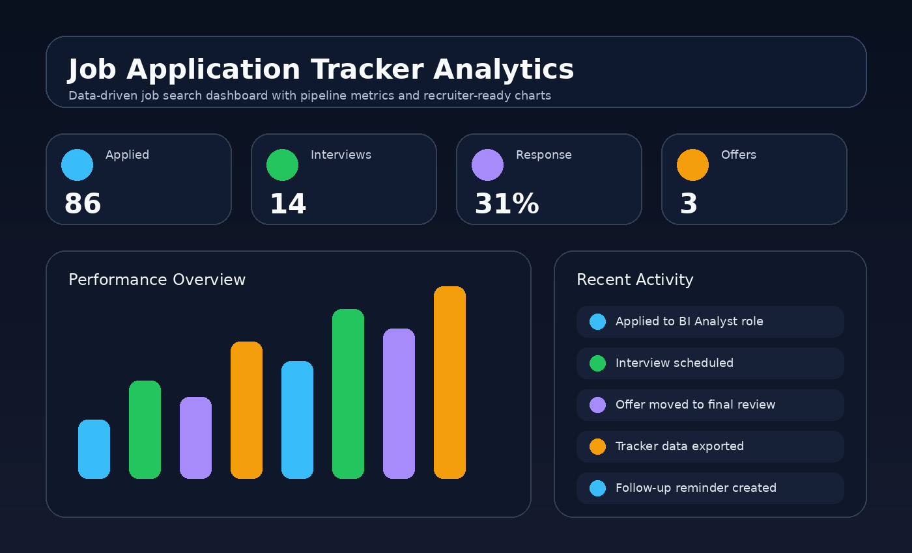

<div align="center">

# JOB APPLICATION TRACKER ANALYTICS

### Career Pipeline & Job Search Performance Dashboard

**Applications. Recruiter responses. Interviews. Offers. Outcomes.**

[](https://www.designhubmk.com)


**Track progress. Improve outcomes. Turn job-search activity into measurable insight.**

</div>

---



---

## Career Analytics Theme

This repository is presented as a career pipeline analytics dashboard. It turns application activity into clear KPIs, interview progress, recruiter response visibility, and outcome tracking.

| Theme Layer | Direction |
|---|---|
| **Design Identity** | Indigo, violet, blue, and modern productivity accents |
| **Product Feel** | Career CRM / job-search performance dashboard |
| **Audience** | Recruiters, hiring managers, candidates, career coaches, frontend reviewers |
| **Core Message** | Applications + interviews + response tracking + outcome intelligence |

---

## Career KPI Layer

| KPI | Purpose |
|---|---|
| **Applications Sent** | Tracks job-search activity volume |
| **Recruiter Responses** | Measures response momentum |
| **Interview Pipeline** | Shows active hiring conversations |
| **Offer Status** | Tracks late-stage opportunity outcomes |
| **Rejection Trends** | Helps identify improvement areas |

---

## Workflow Questions

| Question | Why It Matters |
|---|---|
| **Which applications are active?** | Keeps the candidate focused on current opportunities |
| **Which recruiters responded?** | Helps prioritize follow-up work |
| **Where are interviews happening?** | Shows pipeline strength |
| **What outcomes are repeating?** | Turns job-search history into improvement insight |

---

## What This Project Demonstrates

| Capability | Evidence in This Repo |
|---|---|
| **Dashboard UI Thinking** | Pipeline stages, KPI cards, status sections, and summaries |
| **Workflow Product Design** | Real job-search process turned into a useful interface |
| **Analytics Presentation** | Activity data presented as progress and outcomes |
| **Responsive Frontend Execution** | Static portfolio-ready layout for desktop and mobile |
| **Recruiter-Friendly Storytelling** | The repo itself demonstrates hiring-aware product thinking |

---

## Features

- Application status overview
- Interview and recruiter-response tracking
- KPI-style job-search metrics
- Clean analytics sections for fast review
- Responsive layout for desktop, tablet, and mobile

---

## Run Locally

```bash
python -m http.server 5173
```

Then open:

```text
http://localhost:5173
```

---

## Project Architecture

```text
job-application-tracker-analytics/
├── index.html
├── assets/
│   ├── styles.css
│   ├── app.js
│   └── screenshot.png
└── README.md
```

---

## Author

**Arsim Shefkiu**  
**AI Software Engineer · Full-Stack Developer · SaaS & Automation**

Founder of **DesignHubMK**, building AI-powered software, automation systems, and full-stack digital products.

[](https://www.designhubmk.com)
[](https://www.instagram.com/designhub_mk/)
[](https://github.com/fullstackwithai)

**Website:** https://www.designhubmk.com  
**Instagram:** @designhub_mk

---

<div align="center">

## Job Application Tracker Analytics

**Track progress. Improve outcomes. Turn job-search activity into measurable insight.**

Built by **Arsim Shefkiu · DesignHubMK**

</div>
